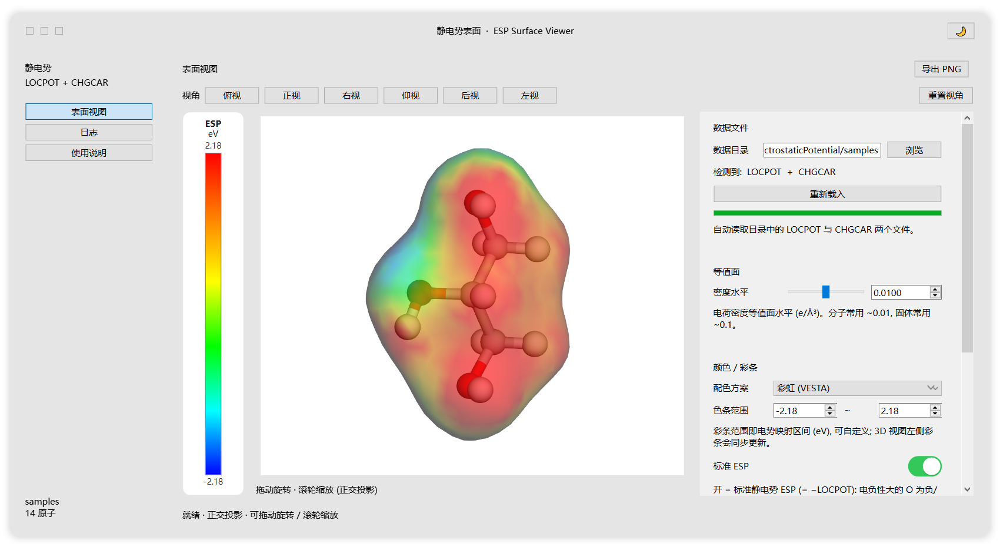
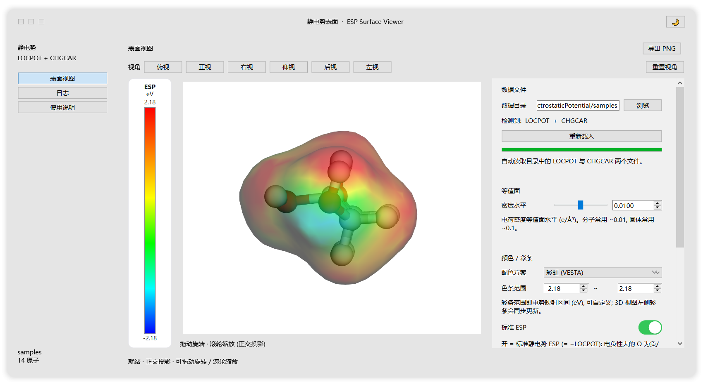

<div align="center">

# 静电势表面查看器 · ESP Surface Viewer

**读取 VASP 的 `LOCPOT` + `CHGCAR`，一键显示 VESTA 风格的
「电荷密度等值面 + 静电势彩虹着色」，颜色与等值面水平随手可调**

[](https://github.com/moyulyy/plot_ElectrostaticPotential/releases/latest)
[](LICENSE)
[](https://www.python.org/)
[](https://pypi.org/project/PySide6/)
[](https://3dmol.csb.pitt.edu/)
[](#)



<sub>俯视图：左侧为稳定的 Qt 彩条，上方为六个标准视角，右侧为实时控制面板</sub>

</div>

> ### ⬇️ 直接下载 · Windows 免安装便携版
> 前往 **[Releases · Latest](https://github.com/moyulyy/plot_ElectrostaticPotential/releases/latest)**
> 下载 `ESP_Viewer_portable_win64.zip`，解压后双击 `ESP_Viewer\ESP_Viewer.exe` 即可运行，
> **无需安装 Python**（内置降采样样例，开箱即见效果）。

---

## ✨ 功能特性

| | 功能 |
|---|---|
| 🧊 | **与参考图一致的显示**：电荷密度等值面 + 静电势**彩虹着色**（VESTA 经典 ESP 图） |
| 📂 | **给定目录自动读取**：扫描目录中的 `LOCPOT`/`POT` 与 `CHGCAR`/`CHG`，一键载入 |
| 📏 | **等值面水平可调**：密度水平（e/ų，分子 ~0.01 / 固体 ~0.1）滑杆 + 数值框实时联动 |
| ➕ | **标准 ESP 符号**：默认 `ESP = −LOCPOT`，电负性大的 O 为负/蓝、H 为正/红（可切回原始 LOCPOT） |
| 🌈 | **颜色 + 彩条**：彩虹 / 反向彩虹 / 红白蓝 / ROYGB / 正弦彩虹 / 自定义三色 |
| 🎚️ | **彩条区间自定义**：直接输入电势范围 `vmin ~ vmax`（eV），左侧彩条实时同步 |
| 📐 | **正交投影**：远近同大，旋转时结构大小恒定 |
| 🧭 | **六个标准视角**：俯视 / 正视 / 右视 / 仰视 / 后视 / 左视（基于实际晶胞矢量，按钮在视图上方） |
| 🖱️ | 拖动旋转、滚轮缩放（正交相机距离驱动） |
| 👁️ | 不透明度、原子样式（球棍/球体/棍棒/线框/隐藏）、原子半径、晶胞、背景色 |
| 📸 | 一键导出 PNG（**含左侧彩条**） |
| 🌗 | 深色 / 浅色主题 |
| 📦 | **可打包便携 exe**：免安装、无需 Python，拷到别的 Windows 电脑即可运行 |
| 🌐 | **离线可用**：本地 3Dmol.js，无需联网 |

---

## 🖼️ 效果预览

| 俯视 | 正视 |
| :---: | :---: |
|  |  |

内置示例为有机分子（`H₈C₃O₃`）：**H 为正电势（红）**、**O 为负电势（蓝）**，
符合化学直觉（O 电负性大带部分负电）。

---

## 📂 目录结构

```
plot_ElectrostaticPotential/
├─ esp_viewer_gui.py     # ★ 主程序 (PySide6 窗口 + 控制面板)
├─ viewer3d.py           # ★ 3Dmol.js 查看器 (正交投影 / 六视角 / 采样配色)
├─ vasp_io.py            # ★ VASP 解析 / 网格降采样 / cube 几何 / 视角四元数
├─ ui_kit.py             # ★ iOS 风格 Qt 控件与主题
├─ 3dmol/3Dmol-min.js    # ★ 本地 3Dmol.js (离线)
├─ assets/app.ico        # 应用图标 (make_icon.py 生成)
├─ make_icon.py          # 生成图标 (可选, 需 Pillow)
├─ make_samples.py       # 生成内置样例 samples/ (可选)
├─ ESP_Viewer.spec       # PyInstaller 打包配置
├─ build_exe.bat         # 双击打包便携程序包
├─ install_deps.bat      # 双击安装依赖
├─ PORTABLE_README.txt   # 便携包使用说明 (打包时复制到 exe 旁)
├─ docs/                 # README 配图
├─ selftest_render.py    # 可选: 无头渲染自检 (需 playwright + Edge/Chrome)
├─ requirements.txt
├─ run_viewer.bat        # 双击启动 (无控制台)
└─ run_viewer_debug.bat  # 双击启动 (保留控制台, 看报错)
```

---

## 🚀 快速开始

### 1. 安装依赖

```bat
python -m pip install -r requirements.txt
```

只依赖 **numpy** 与 **PySide6**（含 QtWebEngine）。

### 2. 运行

```bat
:: 双击 run_viewer.bat
:: 或命令行 (可传入数据目录)
python esp_viewer_gui.py path\to\vasp\dir
```

启动后自动读取目录中的 `LOCPOT` + `CHGCAR`。

### 3. 使用流程

1. **数据文件**：「数据目录」指向含 VASP 结果的目录 → 自动识别 `LOCPOT` + `CHGCAR`
   → 点「重新载入」（启动时已自动载入）。
2. **等值面**：拖动「密度水平」（默认 0.1 e/ų）。
3. **颜色 / 彩条**：选择配色方案；输入「色条范围」（电势区间 eV），左侧彩条同步。
4. **视角**：视图上方 6 个按钮；也可拖动旋转、滚轮缩放。
5. **显示选项**：不透明度、原子样式、原子半径、晶胞、背景色。
6. 右上角「导出 PNG」（含彩条）。

> 提示：电势单位与 `LOCPOT` 一致（eV），电荷密度为 e/ų。

---

## 🔬 实现要点

### 显示模式（对齐 VESTA）

```js
var sh = viewer.addIsosurface(densVD, {isoval: level,
                                       opacity: op, smoothness: 3});
sh.updateStyle({voldata: potVD, volscheme: scheme(cfg)});  // 用电势给密度面染色
```

参考片段中 `VDW + voldata + volscheme` 的思路相同，只是把表面换成
**电荷密度等值面**，即 VESTA 的经典 ESP 图。

### ⚠️ 电势符号（容易弄反）

VASP 的 `LOCPOT` 是**电子势能**（在核附近为大幅度负值），即约为
**−（静电势 Φ）**。而化学中常说的“静电势”是 Φ（正电荷感受到的势）：

| 位置 | 静电势 Φ | 原始 LOCPOT |
|---|---|---|
| H（δ+，电子贫） | **正** | 负 |
| O（δ−，电子富） | **负** | 正 |

因此程序默认对 `LOCPOT` 取负（「标准 ESP」开关打开），使
**O 显示为负/蓝、H 显示为正/红**；关掉开关则显示原始 `LOCPOT`
（部分软件/教程直接画原始值）。

> 提示：做严格 ESP 图建议用 `LVHAR = .TRUE.` 生成 `LOCPOT`
> （只含 Hartree + 离子，不含交换关联项）。

### 正交投影 + 六视角

- `viewer.setProjection('orthographic')`；3Dmol 的 `show()` 会按相机距离重算正交视锥，
  因此用**相机距离**驱动缩放：`dist = halfH / (zoom·tan fov)`，滚轮改 `ORTHO_ZOOM`。
- **逐视角贴合**：把原子 + 晶胞角点用当前四元数旋转到相机系，取投影后 x/y 半宽，
  据此设置正交视锥 —— 俯视时铺满画面，侧视时完整装下高真空晶胞。
- 六视角四元数由**实际晶胞矢量**计算（正/后视 a→x,c→y；俯/仰视 a→x,b→y；
  左/右视 b→x,c→y），与 VESTA 惯例一致。

### 彩条 colorbar（稳定不闪）

彩条是**独立的 Qt 控件**（位于 3D 视图左侧，与网页层叠无关），切换视角时**绝不闪烁**。
颜色由页面用当前配色方案 `sampleColors()` 采样后回传，保证与表面完全一致；
「导出 PNG」时用 `QPainter` 把彩条合成到图上。

### VASP 网格读取

- **索引方向**：VASP 以 **x 最快 / z 最慢**写出；3Dmol 的 `VolumeData` 与 MarchingCube
  以 **x 最慢 / z 最快**索引。因此用 `reshape((nx,ny,nz), order='F')` 得到 `axes=(x,y,z)`
  的物理数组，否则方向就错了。
- **自适应降采样**：网格点数不超过 70 万（大网格自动 ×2/×3，小样例保持原样）。
- **单位**：`LOCPOT` 为 eV；`CHGCAR` 数值为 `ρ·V_cell`，除以晶胞体积得到 e/ų。
- `cube` 头使用**玻尔**单位，非正交晶胞由 3Dmol 的 `matrix` / `inversematrix` 处理。

---

## 🧪 无头渲染自检（可选）

```bat
python selftest_render.py test/LOCPOT 3 test/CHGCAR
```

无头渲染、切换 6 个视角、改变等值面与配色，输出 `SELFTEST OK`。

---

## 📦 打包成便携程序包

双击 **`build_exe.bat`**（默认生成**便携文件夹**，推荐）：

```
dist\ESP_Viewer\
  ESP_Viewer.exe      <- 双击即用
  使用说明.txt
  _internal\          <- 依赖 (Qt / QtWebEngine / 3dmol / 内置样例 / 图标)
```

把整个 `ESP_Viewer` 文件夹拷到任何 Windows 10/11 机器上双击即可运行，**免安装、无需 Python**。

- 内置 `samples/`（降采样样例）：首次启动即可看到效果。
- 用户数据：把含 `LOCPOT` + `CHGCAR` 的目录放到 exe 旁 `test\` 或 `data\`，程序自动读取。
- **单文件模式**（不推荐）：`set ESP_ONEFILE=1` 后再运行 `build_exe.bat`。
- **打包自检**：`dist\ESP_Viewer\ESP_Viewer.exe --selftest`（成功退出码 0）。

---

## ❓ 常见问题

1. **3D 窗口空白** → 更新显卡驱动；确认没有给 WebEngine 的祖先控件加阴影特效（程序已用自绘阴影规避）。
2. **打开较慢** → 首次启动需要初始化 QtWebEngine，属正常。
3. **看不到表面** → 检查是否同时载入了 `LOCPOT` 与 `CHGCAR`，并适当调整「密度水平」。
4. **颜色像是反的** → 见上文「电势符号」；默认已取负得到标准 ESP（O 负/蓝、H 正/红）。
5. **导出 PNG 失败** → 极少数显卡驱动下 WebGL 取图受限，可改用系统截图。

---

## 📄 License

本项目基于 [MIT License](LICENSE) 开源。

<div align="center"><sub>如果这个项目对你有帮助，欢迎点个 ⭐ Star ~</sub></div>
